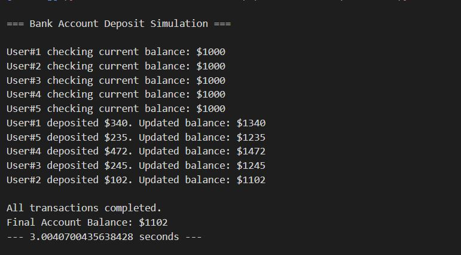
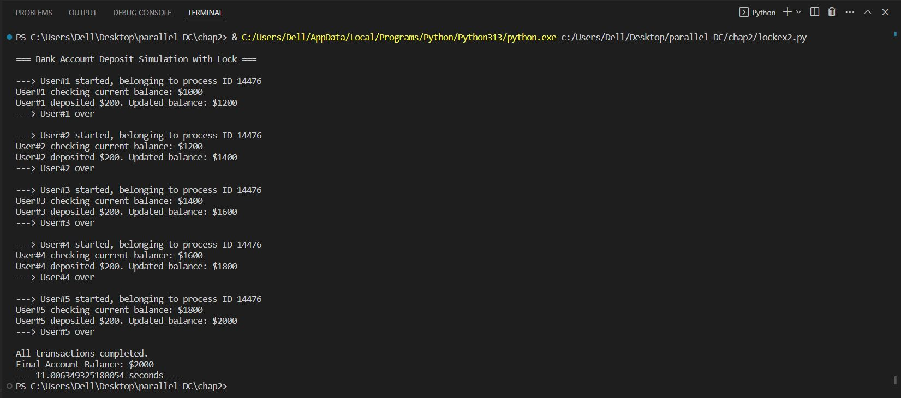
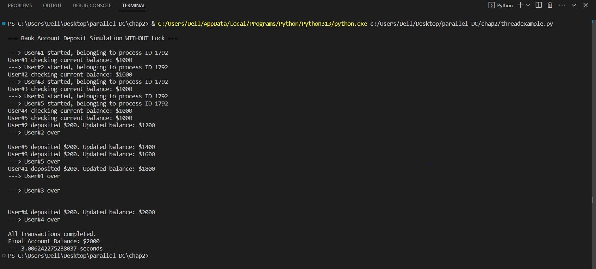

# Chapter 2 – Threading with Lock Demonstration

## Screenshots of Output

### 1. With Lock

### 2. Partial Lock

### 3. Without Lock

---

## Conclusion

In this experiment, three threading cases were tested to compare execution time and data consistency using different lock mechanisms.

1. **Without Lock:**  
   - Execution Time: **~3.006 seconds**  
   - Observation: Multiple threads accessed and modified the shared variable (`account_balance`) simultaneously.  
   - Result: Faster execution but **incorrect and inconsistent** final balance due to race conditions.

2. **With Partial Lock:**  
   - Execution Time: **~3.004 seconds**  
   - Observation: Threads were synchronized during certain operations only.  
   - Result: **Improved accuracy** compared to the unlocked version, but occasional inconsistencies still occurred.

3. **With Full Lock:**  
   - Execution Time: **~11 seconds**  
   - Observation: Each thread waited for its turn to fully access and update the shared resource.  
   - Result: **Completely accurate and consistent** results, but execution was slower due to sequential thread execution.

**Final Verdict:**  
Using a lock ensures **data accuracy and consistency** by preventing race conditions but increases **execution time**. Without a lock, threads run faster but cause data corruption. Therefore, choosing between speed and accuracy depends on the nature of the application.
